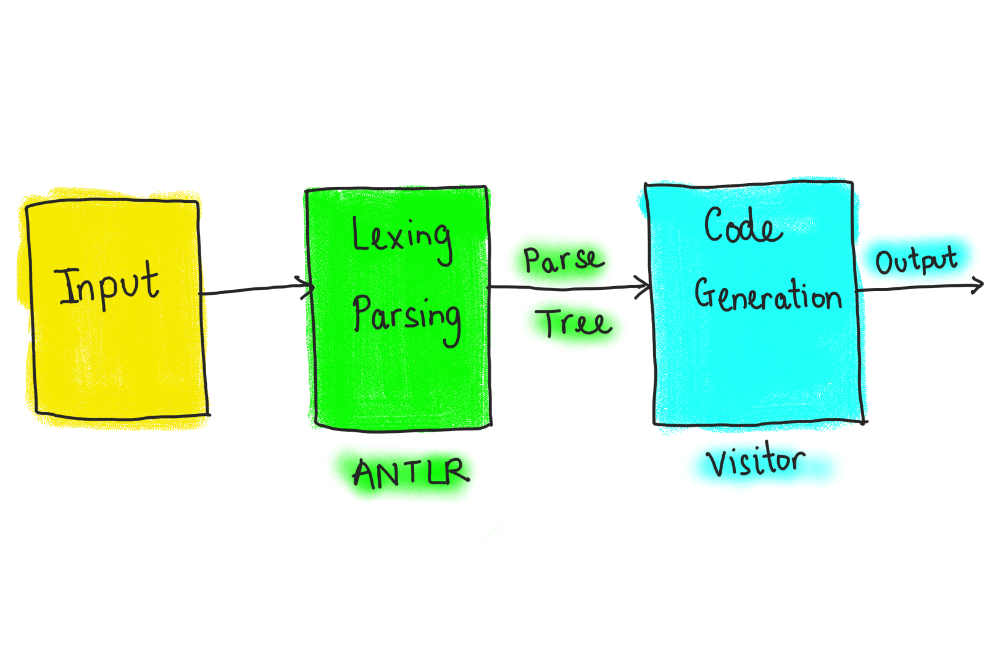

# Synthtax - a small music programming language

Synthtax is a small, typed, imperative music programming language designed for creating and manipulating sound. This minimal language is able to supports some programming constructs such as loops, conditionals, and function calls. Synthtax provides a mechanism to generate and modify sound, specifically, oscillators and ADSR. The language is implemented as a C++ transpiler using the C++ programming language and ANTLR.

## Table of Contents

<!-- vim-markdown-toc GFM -->

* [Grammar and Syntax](#grammar-and-syntax)
    * [Types](#types)
    * [Variables](#variables)
    * [Print](#print)
    * [Functions](#functions)
    * [Conditionals](#conditionals)
    * [Loops](#loops)
    * [Oscillators](#oscillators)
        * [Create an oscillator](#create-an-oscillator)
        * [Write an oscillator to a `.wav` file](#write-an-oscillator-to-a-wav-file)
        * [Operators](#operators)
    * [ADSR](#adsr)
        * [Create an ADSR](#create-an-adsr)
        * [Apply an ADSR to an oscillator](#apply-an-adsr-to-an-oscillator)
    * [Headers](#headers)
* [Installation](#installation)
* [How to run](#how-to-run)
* [How Synthtax works](#how-synthtax-works)
* [Future Development](#future-development)
* [Goals](#goals)
* [Reference](#reference)
* [Resources](#resources)

<!-- vim-markdown-toc -->

## Grammar and Syntax

Synthtax has a relatively simple grammar and syntax. Here are some of the key features of the language:

### Types

| Type | Description |
|---|---|
| `void` | C++ equivalent: `void` |
| `int` | C++ equivalent: `int` |
| `float` | C++ equivalent: `float` |
| `char` | C++ equivalent: `char`</br>Rule: `'\'' [a-zA-Z_.] '\''` |
| `string` | C++ equivalent: `std::string`</br>Rule: `'"' [a-zA-Z_0-9.]* '"'` |
| `osc` | Oscillator object |
| `env` | ADSR object |

### Variables

Declaring a variable is similar to C++

**Identifier** rule: `[a-zA-Z_]+`

Example:

```c
int a = 2;
float b = 3.5;
string c = "hello";
osc d = Osc("sine", 440.0, 1.0, 1.0);
```

### Print

Print an expression with `print` and `println`

Example:

```c
print "hello";
print (2 + 3);
println 'a';
```

### Functions

Functions are defined with return type, followed by the function name, and parameters if any.

Example:

```c
int add(a: int, b: int) {
  return a + b;
}
```

### Conditionals

There are `if` and `else` only.

Example:

```c
if (2 < 3) {
  print "yes";
} else {
  print "no";
}
```

### Loops

Loop with `while`

Example:

```c
int i = 0;
while (i < 5) {
  i = i + 1;
}
println i;
```

### Oscillators

#### Create an oscillator

Create an oscillator with type `osc` and the `Osc()` function.

Constructors:

```c
osc Osc(type: string, frequency: float, amplitude: float)
osc Osc(type: string, frequency: float, amplitude: float, duration: float)
osc Osc(type: string, frequency: float, amplitude: float, duration: float, sound: std::vector<float>)
```

An `Osc()` function accepts one of the 3 types: `sine`, `triangle`, `sawtooth`

Example:

```c
 osc a = Osc("sine", 440.0, 1.0, 1.0);
```

#### Write an oscillator to a `.wav` file

Use `write()` function to write an oscillator to a `.wav` file.

Signatures:

```c
write(oscillator: osc, outfile: string, duration: float); // write an oscillator with a duration
write(oscillator: osc, outfile: string); // write an oscillator without a duration, default 1s
```

Example:

```c
osc s = Osc("sine", 440.0, 1.0);
write(s, "sine440.wav", 2.0);
```

#### Operators

Add, subtract, and multiply 2 oscillators. Return a new oscillator with a duration that equals to the longer one.

Example:

```c
osc a = Osc("sine", 440.0, 1.0, 1.0);
osc b = Osc("sine", 220.0, 0.8, 1.5);
osc c = a + b;
osc d = a - b;
osc e = a * b;
```

### ADSR

#### Create an ADSR

Create an ADSR with type `env` and the `ADSR()` function.

Constructors:

```c
env ADSR(); // default
env ADSR(decay_time: float, sustain_time: float, release_time: float, sustain_level=0.8: float); // attack always starts at 0s
```

Example:

```c
env envDefault = ADSR();

/*
attack starts at 0s
decay starts at 1.0s
sustain starts at 2.5s at default amplitude
release starts at 5.0s
*/
env envParams = ADSR(1.0, 2.5, 5.0);

/*
attack starts at 0s
decay starts at 3.0s
sustain starts at 5.5s at 0.7 amplitude
release starts at 6.0s
*/
env envLevel = ADSR(3.0, 5.5, 6.0, 0.7);
```

#### Apply an ADSR to an oscillator

Apply an ADSR to an oscillator with the `apply()` function. Return a new oscillator.

Signature:

```c
osc apply(envelop: env, oscillator: osc)
```

Example:

```c
osc a = Osc("sine", 440.0, 1.0, 7.5);
env envDefault = ADSR();
osc oscDefault = apply(envDefault, a);
```

### Headers

Write the block between the 2 keywords `@header` and `@end_header` verbatim at the beginning of the transpilled file. his allows the user to use some functions in their header files, define some data types or macros.

Example:

```c
@header
#include <math.h>
#include "myadd.h"
using namespace std;
@end_header

int main() {
  int a = myadd_func(2, 3); // from myadd.h
  int b = max(a, 6); // from std library
  println b;
}
```

## Installation

Clone or download this project

**Requirements**:

- Java
- C++ compiler
- CMake
- `libsndfile` to write a `.wav` file (see [github.com/libsndfile](https://github.com/libsndfile/libsndfile))
 
## How to run

1. `./generate.sh` : generate lexer, parser, visitor classes
2. `cmake -S ./ -B build` : create build
3. `cd build; make` : compile and link
4. `./synthtax <filename>` : run the file

At this point, you will get an `output.cpp` file. Do `cd ..` to the project base directory to see the file.

Compile `outfile.cpp` with your favourite C++ compiler. If you have `write_to_file()` function in `output.cpp` (i.e., if you want to write to a `.wav` file), you need to add `-lsndfile` flag to link with the `libsndfile` library. I will figure out how to link `libsndfile` in CMake in the future (probably include this [cmake folder](https://github.com/libsndfile/libsndfile/tree/master/cmake))

Example:

```
g++ output.cpp -lsndfile
```

## How Synthtax works

<p align="center">
  
</p>

At first I attempted to write a lexer and a parser from scratch. Then I quit after spending several days debugging, and switched to ANTLR instead. ANTLR is a great tool to create a parse tree without too much effort, even though I had lots of ups and downs with it.

ANTLR is made up of two main parts: the tool and the runtime. The tool consists of Java and an ANTLR `.jar` file, which is included in the project. There is a different runtime for every target language. Since the target language is C++, C++ runtime library is needed to generate the lexer and parser code. To use the newly generated clases, they need to be compiled and linked against the C++ runtime library. Building a C++ project on different platforms can be quite complicated. Thankfully, the official ANTLR repository provides an [Antlr4Cpp](https://github.com/antlr/antlr4/tree/master/runtime/Cpp/cmake) external project, which aids the integration process.

To use ANTLR, I need to input my grammar for the Synthtax language (i.e., `SynthtaxLexer.g4` and `SynthtaxParser.g4`). Then ANTLR will produce a parser class and a standard base visitor class. To do code generation, I just need to implement the Visitor class (i.e., `Visitor.h`).

For now, an audio is written to a `.wav` file using `libsndfile` library. Implementation for Synthtax built-in functions such as Oscillator and ADSR can be found in the [include folder](https://github.com/iamvickynguyen/Synthtax/tree/antlr/include/synths). These objects are transpilled as smart pointer objects because their memory can be deallocated automatically, and I don't have to keep track of which objects are created and add some delete statements.

## What was learned

- How to design a programming language
- How hard it is to write a lexer and parser from scratch
- How to write a proper ANTLR grammar
- How to intergrate the C++ runtime
- How to generate C++ code with the parse tree
- How to properly link libraries and header files in CMake
- How static typed and dynamic typed language can be transpiled
- A bit of RTAudio and libsndfile
- Project structure, documentation, a better software engineer

## Future Development

Synthtax is a small language and it does not support many programming constructs. In the future, I will expand its capabilities such as adding arrays, and some digital processing concepts such as frequency modulation, filters, and getting MIDI input.

## Goals

1. Worst case: Show the AST generated by ANTLR with the Synthtax grammar, and show how a `.wav` can be generated with `libsndfile` library
2. Expected: The program can produce C++ code and link with the Synthtax built-in C++ code, and it can generate a `.wav` file
3. Stretch: Expand Synthtax capabilities such as adding arrays, and some digital processing concepts such as frequency modulation, filters, and getting MIDI input.

## Reference

1. [github.com/antlr/antlr4/tree/master/runtime/Cpp/cmake](https://github.com/antlr/antlr4/tree/master/runtime/Cpp/cmake): build files for many platforms

## Resources

1. [Antlr4 for C++ blog](https://beyondtheloop.dev/Antlr-cpp-cmake/)
2. [lab.antlr.org](http://lab.antlr.org/)
3. [Getting Started with ANTLR in C++](https://tomassetti.me/getting-started-antlr-cpp/)
4. [Demo application for the ANTLR4 C++ target](https://github.com/antlr/antlr4/tree/master/runtime/Cpp/demo)
5. [ANTLR Based Transpiler](https://github.com/ram-nad/ANTLR-Based-Transpiler)
